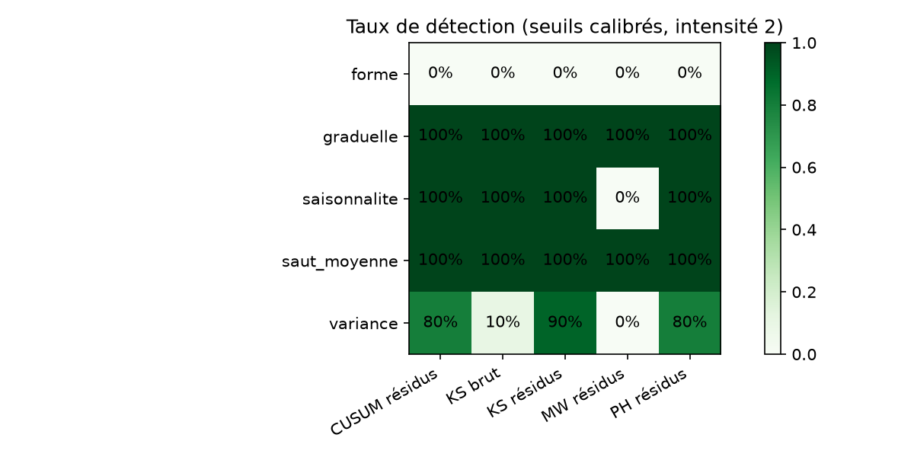
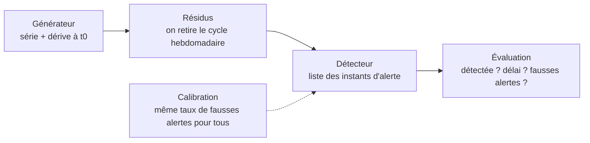
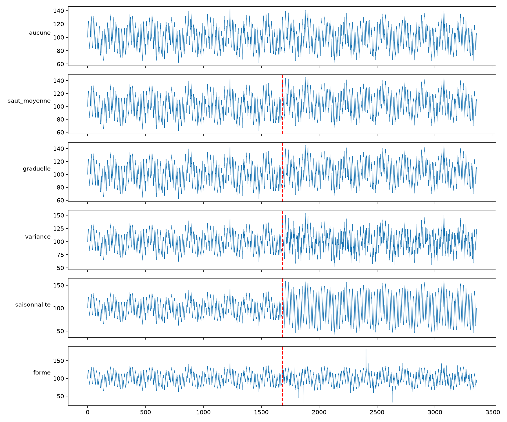

<div align="center">

# ⚡ derive-projet

### Détecter la dérive dans les séries de consommation énergétique — vite, et sans fausses alertes


**5 détecteurs · 5 types de dérive · 1 banc d'essai équitable**

</div>

---

## 🎯 Le problème

Un modèle de prévision de consommation énergétique est entraîné sur un comportement
« normal ». Le jour où ce comportement change — nouvelle machine, nouvelle règle,
événement climatique — le modèle se trompe **sans prévenir**. Ce changement s'appelle
la **dérive**.

Ce projet répond à une question simple :

> **Quel détecteur repère la dérive le plus vite, avec le moins de fausses alertes, et sur quel type de dérive ?**

Pour y répondre honnêtement, tout est construit à la main : le générateur de données,
les détecteurs, la règle d'évaluation et la calibration qui rend la comparaison équitable.

## 🏆 Résultats

Taux de détection de chaque méthode, seuils calibrés, 10 séries par type de dérive (intensité 2) :

<div align="center">

</div>

Délai moyen de détection, en heures après la rupture (plus petit = mieux) :

| Type de dérive | CUSUM résidus | PH résidus | KS résidus | MW résidus | KS brut |
|---|---:|---:|---:|---:|---:|
| `saut_moyenne` | **31,5** | 35,2 | 54,9 | 55,7 | 92,4 |
| `saisonnalite` | **10,2** | 10,4 | 102,1 | — | 71,7 |
| `variance` | **66,4** | 68,3 | 168,3 | — | 248,0 |
| `graduelle` | **133,1** | 147,9 | 139,8 | 134,2 | 190,3 |
| `forme` | — | — | — | — | — |

**Ce qu'il faut retenir**

- 🥇 **CUSUM sur résidus est le plus rapide** sur tous les types qu'il détecte, suivi de près par Page-Hinkley.
- 🧹 **Travailler sur les résidus change tout** : sur la dérive de variance, KS passe de 10 % (série brute) à 90 % de détection (résidus).
- 🙈 **Mann-Whitney ne voit que les changements de niveau** : 0 % sur la variance et la saisonnalité, comme attendu pour un test de position.
- 🚧 **La dérive de forme reste invisible** pour les cinq méthodes (0 %) : même moyenne, même écart-type, seules les queues changent. C'est la limite ouverte du projet.
- ✅ **Aucune fausse alerte** avant la rupture sur les 250 séries du banc d'essai.

## 🔬 Comment ça marche



### 1. Des données dont on connaît la vérité

Série horaire de 3 360 points (20 semaines) : niveau + cycle 24 h + cycle 168 h + bruit AR(1).
Une dérive est injectée au milieu, à `t0 = 1680`. Comme on connaît `t0`, on peut noter chaque détecteur.

<div align="center">

</div>

| Type | Ce qui change |
|---|---|
| `saut_moyenne` | le niveau monte d'un coup |
| `graduelle` | le niveau monte sur 200 heures |
| `variance` | le bruit devient plus agité |
| `saisonnalite` | le cycle jour/nuit s'amplifie |
| `forme` | mêmes écarts, mais plus de valeurs extrêmes |

### 2. Cinq détecteurs, une seule règle

Entrée : une série. Sortie : la liste des instants d'alerte.

| Détecteur | Idée | Fichier |
|---|---|---|
| **CUSUM** | les écarts à la référence s'accumulent dans le même sens | `src/detecteurs_stat.py` |
| **Page-Hinkley** | la moyenne monte ou baisse durablement | `src/detecteurs_stat.py` |
| **KS glissant** | la forme complète de la distribution change | `src/detecteurs_stat.py` |
| **Mann-Whitney glissant** | une fenêtre a des valeurs plus grandes que l'autre | `src/detecteurs_stat.py` |
| **KS de base** | version naïve sur la série brute (point de départ) | `src/detecteurs_base.py` |

### 3. Une comparaison qui n'est pas truquée

Un détecteur réglé « nerveux » paraît toujours plus rapide qu'un détecteur réglé « prudent ».
Avant de comparer, **chaque détecteur est donc calibré** : on choisit le réglage le plus
sensible qui laisse au plus **10 % de séries calmes** avec une fausse alerte
(`src/calibration.py`). Tous partent ainsi sur la même ligne.

### 4. Une règle de notation claire

- Alerte avant `t0` → **fausse alerte**
- Première alerte dans `[t0, t0 + 300]` → **détection**, délai = alerte − `t0`
- Aucune alerte dans cette fenêtre → **détection manquée**

Le protocole complet est dans [`docs/protocole.md`](docs/protocole.md).

## 🚀 Démarrage rapide

```bash
git clone https://github.com/mounabensmida/derive-projet.git
cd derive-projet
python -m venv .venv
.venv\Scripts\activate          # Linux / macOS : source .venv/bin/activate
pip install -r requirements.txt
```

Lancer le banc d'essai complet, puis tracer la figure :

```bash
python notebooks/bench_semaine2.py
python notebooks/figure_semaine2.py
```

Utiliser un détecteur dans votre propre code :

```python
from src.generateur import generer_serie, evaluer
from src.residus import residus
from src.detecteurs_stat import cusum

serie, t0 = generer_serie(seed=1, type_derive="saut_moyenne", intensite=2.0)
alertes = cusum(residus(serie))
print(evaluer(alertes, t0))
```

Lancer les tests :

```bash
python -m pytest
```

## 📁 Structure

```
derive-projet/
├── src/
│   ├── generateur.py        # séries synthétiques, injection de dérive, évaluation
│   ├── residus.py           # retrait du cycle hebdomadaire, standardisation
│   ├── detecteurs_base.py   # KS naïf (semaine 1)
│   ├── detecteurs_stat.py   # CUSUM, Page-Hinkley, KS et Mann-Whitney glissants
│   └── calibration.py       # choix du seuil à taux de fausses alertes égal
├── notebooks/               # scripts d'essai, bancs d'essai, figures, comparaison avec river
├── tests/                   # tests pytest du générateur et des détecteurs
├── docs/protocole.md        # protocole d'évaluation
├── figures/                 # figures générées
└── resultats_semaine2.csv   # résultats bruts du banc d'essai
```

## 🗓️ Avancement

- [x] **Semaine 1** — générateur, règle d'évaluation, KS de base, tests
- [x] **Semaine 2** — résidus, CUSUM, Page-Hinkley, KS et Mann-Whitney glissants, calibration, banc d'essai, comparaison avec `river` (ADWIN, KSWIN)

## ⚠️ Limites connues

- Données **synthétiques** uniquement, pas encore de données réelles.
- **10 graines** par type de dérive et **un seul niveau d'intensité**.
- Fausses alertes mesurées seulement sur la partie avant `t0`.
- La dérive de **forme** n'est détectée par aucune méthode.

---

<div align="center">

Projet réalisé par [@mounabensmida](https://github.com/mounabensmida)

</div>
